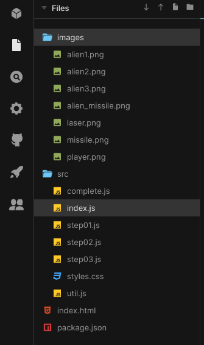
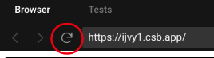
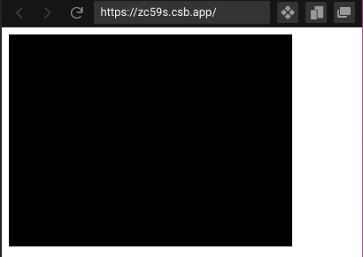
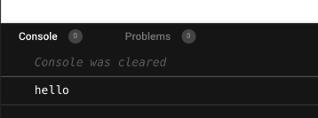
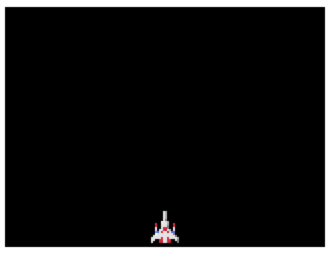
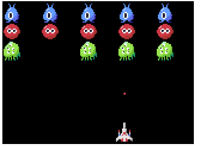

# Javascript シューティングゲーム

## 目次

- [Javascript シューティングゲーム](#javascript-シューティングゲーム)
  - [目次](#目次)
  - [この教材について](#この教材について)
  - [Step 00: CodeSandboxアカウントの登録](#step-00-codesandboxアカウントの登録)
  - [Step 01: Java Script と PIXI.jsの始まり](#step-01-java-script-と-pixijsの始まり)
  - [Step 02: キャラクターを表示してみよう](#step-02-キャラクターを表示してみよう)
    - [課題 02](#課題-02)
  - [Step 03: Java Scriptについて](#step-03-java-scriptについて)
    - [課題 03](#課題-03)
  - [Step 04: 自機を表示しよう](#step-04-自機を表示しよう)
    - [課題 04](#課題-04)
  - [Step 05: 矢印キーで自機を移動しよう](#step-05-矢印キーで自機を移動しよう)
  - [Step 06: 自機の移動範囲を制限して画面から出ないようにしよう](#step-06-自機の移動範囲を制限して画面から出ないようにしよう)
  - [Step 07: ミサイルを発射しよう](#step-07-ミサイルを発射しよう)
  - [Step 08: エイリアン（敵）を配置しよう](#step-08-エイリアン敵を配置しよう)
  - [Step 09: エイリアンを規則的に動かそう](#step-09-エイリアンを規則的に動かそう)
  - [Step 10: エイリアンもミサイルを打ってくるようにしよう](#step-10-エイリアンもミサイルを打ってくるようにしよう)
  - [Step 11: ゲームクリア/ゲームオーバー](#step-11-ゲームクリアゲームオーバー)
  - [Step 12: ミサイルを画面内3発まで発射できるようにしよう](#step-12-ミサイルを画面内3発まで発射できるようにしよう)
  - [Step 13: Zキーで3-wayミサイルを発射できるようにしよう](#step-13-zキーで3-wayミサイルを発射できるようにしよう)
  - [Step 14: Xキーでレーザーを発射できるようにしよう](#step-14-xキーでレーザーを発射できるようにしよう)
  - [さらに改良するには？](#さらに改良するには)

## この教材について

- これは「シューティングゲーム」の作り方を通してJava ScriptとPIXI.jsを学ぶための教材です
- この教材では[このCodeSandboxの教材](https://codesandbox.io/s/shooting-game-ijvy1)を使用します

-----

## Step 00: CodeSandboxアカウントの登録

- 初回はCodeSandboxにアカウントがないと思いますので、以下の手順でアカウントを作成しましょう
  - <https://codesandbox.io/>から`Sign In`を選択し、`Sign in with Google`を選択
  - 自分のGoogle Account用のパスワードを入力すると、`username`と`display name`を聞かれます
  - この名前は外部から見られますので、本名や本人が特定できる情報は入力しないでください
  - 入力したら、`Finish Sign Up`ボタンを押すと登録完了です
- 次回以降は今回作成したアカウントで`Sign In`（ログイン）できます

-----

## Step 01: Java Script と PIXI.jsの始まり

- まずは[CodeSandboxの教材](https://codesandbox.io/s/shooting-game-ijvy1)を開いてみましょう
- Filesに進むと、以下のようなファイルが用意されています



- `src`フォルダ内にある`index.js`を開いて、内容を全て以下のスクリプトで置き換えてください。同様の内容はCode Sandbox内の`step01.js`にも保存されています。
- Ctrl-Sでセーブすると、初回はForkするか聞かれますので、Yesと答えてください。
- Forkすると、初めに読み込み専用で開いたCode Sandoboxの教材スクリプトを全て自分の環境にコピーし、変更・セーブできるようになります。

```js
import "./styles.css";
import { init } from "./util.js";

// 初期化
init(setUp, gameLoop);

function setUp() {}

function gameLoop() {}
```

- セーブするとブラウザの右側に黒い四角い背景が現れます
- セーブ後ブラウザの右側が再表示されない場合は、右上の再読み込みボタンを押してください
- これがこれから作成するゲーム画面になります



-----

## Step 02: キャラクターを表示してみよう

- `index.js`の中を`step02.js`で置き換えて、alienを表示してみよう
- Step 01からの変更点は、2行目の`import`と`setUp`関数の中身です
- `import`は今回は気にしないでください
- `setUp`はプログラムを実行すると最初に1回だけ呼び出される関数です
- `gameLoop`はゲーム開始後`setUp`が呼ばれた後に、1秒間に60回定期的に呼ばれる関数です
- `//`以降はコメント行で、自由なコメント（自分のメモ）を記述できます

```js
import "./styles.css";
import { init, sprites, createSprite } from "./util.js";

// 初期化
init(setUp, gameLoop);

function setUp() {
  let alien = createSprite(sprites.alien1);
  alien.position.x = 16;
  alien.position.y = 16;
}

function gameLoop() {}
```

- うまく行くとalien1が表示されます


### 課題 02

- Spriteを回転させてみよう
  - ヒント: `alien.rotation`
- Spriteの位置を変えてみよう
  - ヒント: `alien.position.x`

-----

## Step 03: Java Scriptについて

- Step 03では、Step 04以降ゲームを作っていく上で必要なJavascriptの基本について学びます
- `index.js`の`setUp`関数の中を全て消去し、以下のように`console.log`を追加して実行してみよう

  ```js
  // Step 03
  console.log("hello");
  ```

- `Console`ウィンドウを開くと`hello`と表示されたのがわかります



- 変数とは
  - 変数`x`の作成と代入
  - `x = 3`の`=`は、右にある数字の3を左にある変数`x`に「代入する（設定する）」という意味です

    ```js
    let x = 3;
    console.log(x);
    ```

  - 作成した変数`x`に1を足す
  - `x = 3`の`=`は、右にある数字の3を左にある変数`x`に「代入する（設定する）」という意味です

    ```js
    x = x + 1;
    console.log(x);
    ```

  - 変数同時は演算することもできます

    ```js
    let a = 10;
    let b = 2;
    let c = a + b;
    console.log(c);
    ```

  - 整数だけでなく、少数や文字列も変数に代入できます

  ```js
  let d = 123.45;
  let s = "hello";
  console.log(d);
  console.log(s);
  ```

  - 文字列と少数又は整数を`+`すると、文字列として連結されます

  ```js
  console.log(d+s);
  ```

- `if`構文とは？

  ```js
  let x1 = 3;
  let x2 = 4;

  /// === では、左辺と右辺が同じならTrueになります
  if (x1 === 3) {
    console.log("x1 is 3");
  } else {
    console.log("x1 is not 3");
  }

  if (x2 === 3) {
    console.log("x2 is 3");
  } else {
    console.log("x2 is not 3");
  }
  ```

- `==`（型が違っても同じ値ならTrue)と`===`（型も同じでなくてはならない）

  ```js
  let x3 = 3;
  let s3 = "3";
  if (x3 == s3) {
    console.log("==");
  } else {
    console.log("not ==");
  }
  if (x3 === s3) {
    console.log("===");
  } else {
    console.log("not ===");
  }
  ```

- `for`構文とは？
  - `for` 基本型

  ```js
  for (let x4 = 1; x4 <= 3; x4 = x4 + 1) {
    console.log("x4=" + x4);
  }
  ```

  - `++`のようにも書けます

  ```js
  for (let x4 = 1; x4 <= 3; x4++) {
    console.log("x4=" + x4);
  }
  ```

- `array`（配列）とはなんだろう？
  - `array`を使って複数の整数を格納してみよう
  - index（インデックス）を使ってarrayの中身を表示してみよう
  - `for`を使ってarrayの中身を全て表示してみよう
  - index（インデックス）を使ってarrayの中身を変更してみよう

  ```js
  let a1 = [3, 5, 9];
  console.log(a1[0]);
  console.log(a1[1]);
  console.log(a1[2]);

  for (let i = 0; i <= 2; i++) {
    console.log("a1[" + i + "]=" + a1[i]);
  }

  a1[1] = 100;

  for (let i = 0; i <= 2; i++) {
    console.log("a1[" + i + "]=" + a1[i]);
  }
  ```

- `dictionary`（辞書とはなんだろう）？
  - `dictionary`を使って複数の文字列を格納してみよう
  - key（キー）を使ってdictionaryの中身を表示してみよう
  - key（キー）を使ってdictionaryの中身を変更してみよう
  - `for`を使ってdictionaryの中身を全て表示してみよう

  ```js
  let d1 = { apple: 3, orange: 5 };
  console.log(d1);
  console.log(d1["apple"]);
  console.log(d1["orange"]);

  d1["apple"] = 100;
  console.log(d1["apple"]);

  for (let [k, v] of Object.entries(d1)) {
    console.log("k="+k+", v="+v);
  }
  ```

- 関数とは
  - `myadd(a, b)`関数を作って、a+bを返そう

  ```js
  // setUp内にこれを書く
  let f1 = 10;
  let f2 = 20;
  let f3 = myadd(f1, f2);
  console.log(f3);

  // 一番外のスコープにこれを書く
  function myadd(a, b) {
    return a + b;
  }
  ```

### 課題 03

- `a1`という変数名のarrayを作って、`for`を使ってそのarrayに1から100までの整数を格納してみよう

  ```js
  a1 = []
  for(let i=0;i<100;i++){
    a1[i] = i;
  }
  ```

- 1から100まで格納した上記`a1`を列挙（巡回）して、全ての数字を表示してみよう
- `dictionary`にいくつかのkey - valueペアを代入しよう
- その`dictionary`を列挙（巡回）して、全てのkey - valueペアを`console.log`してみよう
- `myadd`のように、与えられた2つの整数を引き算して値を返す`mysub(a, b)`関数を作ろう

-----

## Step 04: 自機を表示しよう

- Step 03までで準備は完了です！ここからはゲームを作っていきましょう
- まずは、`step04.js`の内容を`index.js`にコピーし、実行してみよう
- `init(setUp, gameLoop);`を最初に1回だけ読んで、ゲームを初期化します
  - `setUp`は最初に1回だけ呼ばれます
  - `gameLoop`は1秒間に60回呼ばれます
  - `gameLoop`の中でキーボードの状態を取得し、ゲームの進行を行います
- `player.png`を自機として表示してみよう
  - `setUp`内で自機を作成してみよう
  - 事前に`sprites.player`, `sprites.alien1`, `sprites.missile`などが用意されています
  - 何が用意されているかは`util.js`の中の`init`関数を見てみよう
  - `util.js`に用意されている`createSprite`関数にsprite.*を渡すと、新しくそのスプライトが作成されます

```js
function setUp() {
    // 自機のセットアップ
    let player = createSprite(sprites.player);
    player.x = 160;
    player.y = 220;
}
```

- 自機の初期表示位置は(160,220)にしよう



### 課題 04

- `player.x`や`player.y`を変更して、何が変わるのか見てみよう

-----

## Step 05: 矢印キーで自機を移動しよう

- Step 05ではStep 04で表示した自機をキーボードで動かします
- キーボード入力は`util.js`内の`keyboard`を使用して取得します
- まず、初回に1回だけ呼ばれる`setUp`にて、キーボード入力に対する設定を行います
  - キーボードの左矢印キーが押されたら、`left.press`イベントが発生します
  - イベントが発生したら`player.vx`プロパティ（辞書のアイテム）を+4または-4に設定します
- 1秒に60回呼ばれる`gameLoop`にて、
  - プレイヤーの横座標を示す`player.x`に`player.vx`を足します
  - `vx`はx方向のvelocity（加速度）という意味です
- `player`は`setUp`関数で初期化されますが、`gameLoop`関数でも使えなくてはなりません。そのため、`let global;`を一番外側において、どの関数でも使えるグローバル変数にします

```js
import "./styles.css";
import { init, keyboard, sprites, createSprite } from "./util.js";

// グローバル変数
let player;

// 初期化
init(setUp, gameLoop);

function setUp() {
  // 自機のセットアップ
  player = createSprite(sprites.player);
  player.vx = 0;
  player.x = 160;
  player.y = 220;

  // キーボード入力受付
  let left = keyboard("ArrowLeft");
  let right = keyboard("ArrowRight");

  left.press = () => {
    player.vx = -4;
  };
  right.press = () => {
    player.vx = 4;
  };
}

function gameLoop() {
  // 自機を動かす
  player.x += player.vx;
}
```

- 実行してみましょう
- 自機が左右に動きますが、矢印キーが押されていない時も止まりません
- 矢印キーが離されたら止まるように、以下のコードを追加しましょう
- 詳細は`step05.js`を参照してください
- `if`や`===`を覚えていない場合は、Step 03を参照してください

```js
function setUp() {
// 省略...

left.release = () => {
    if (player.vx === -4) {
      player.vx = 0;
    }
  };
right.release = () => {
    if (player.vx === 4) {
      player.vx = 0;
    }
  };
}
```

-----

## Step 06: 自機の移動範囲を制限して画面から出ないようにしよう

- 自機が画面から出ないように、以下の処理を追加しよう
  - 自機が画面の左端よりも左に来たら、左端に戻す
  - 自機が画面の右端よりも右に来たら、右端に戻す
- 画面のサイズは、`app`をimportすることにより取得できます

  ```js
  import { app, init, keyboard, sprites, createSprite } from "./util.js";
  console.log(app.view.width); // 320です
  ```

- 上記を行うには、`gameLoop`内に以下のように書くことができます
  - `Math.max`を使って自機のX座標を現在の値と画面の左端のうち大きい方にする
  - `Math.min`を使って自機のX座標を現在の値と画面の右端のうち小さい方にする
- 境界チェックのためのこの`Math.max/min`の使い方はよくでてきますので覚えておきましょう

  ```js
      player.x = Math.max(player.x, player.width / 2);
      player.x = Math.min(player.x, app.view.width - sprites.player.width / 2);
  ```

-----

## Step 07: ミサイルを発射しよう

- ここまでで自機が移動できるようになりましたので、次にスペースキーでミサイルを1発だけ発射できるようにしよう
  - ミサイルが画面にないときはまたミサイルが発射でき、ミサイルが画面内にあるときは発射できないようにしよう
  - ミサイルが発射されたら`missile`の位置を自機の位置あたりに設定し、`gameLoop`内で位置を更新しよう
  - ミサイルは画面の外に出たら消えるようにしよう
- まず、ミサイルを保存するグローバル変数`missile`を作成し、`null`に初期化します。`null`は何もない値という意味です

```js
let missile = null;
```

- そして、`setUp`にスペースキーの処理を追加します。仕組みは`player`の動かし方と同じです
- 今回、ミサイル発射時の処理は`player`の時よりちょっと長いため、`fire`という関数にします

```js
let space = keyboard(" ");
space.press = () => {
  console.log("fire!");
  fire();
};
```

- `fire`関数で、`missile`がnullの時だけミサイルを作成し、初期位置を設定します。こうすることにより、ミサイルが何発も同時に発射っされることを防ぎます

```js
function fire() {
  if (missile === null) {
    missile = createSprite(sprites.missile);
    missile.x = player.x;
    missile.y = player.y - player.height / 2;
    missile.vy = -4;
    missile.vx = 0;
  }
}
```

- 最後に、`gamelooop`でミサイルを動かします
- また、ミサイルが画面外に出たらミサイルを`removeSripte`で削除し、nullに初期化します

```js
import {
  // ... 省略
  removeSprite
} from "./util.js";

function gameLoop() {
  // ... 省略

  // ミサイルを動かす
  if (missile !== null) {
    missile.y += missile.vy;
    missile.x += missile.vx;
    // ミサイルが画面外に出たら削除し、nullに初期化
    if (missile.y < 0) {
      removeSprite(missile);
      missile = null;
    }
  }
}
```

- 詳細は`step07.js`を参照してください

-----

## Step 08: エイリアン（敵）を配置しよう

- 配列にエイリアンを格納し、表示しよう
- まず、複数のエイリアンを格納する`alians`というarray（配列）を作成します

```js
let aliens = [];
```

- そして、`setUp`関数内で3行5列=15匹のエイリアンのSpriteを作成し、作ったSpriteを`alians`のarrayにpush（追加）します
- こうすることにより、`aliens`は15個の要素を持つ配列になります

```js
// エイリアンのセットアップ
for (let j = 0; j < 3; j++) {
  for (let i = 0; i < 5; i++) {
    let alien;
    if (j === 0) {
      alien = createSprite(sprites.alien1);
    } else if (j === 1) {
      alien = createSprite(sprites.alien2);
    } else {
      alien = createSprite(sprites.alien3);
    }
    alien.x = 16 + i * 64;
    alien.y = 20 + j * 32;
    aliens.push(alien);
  }
}
```

- ミサイルが当たったらエイリアンを消去しよう
- ミサイルにあったかどうかの判定はミサイルとエイリアンのx, y座標の差の絶対値が16以下の場合としよう
- ミサイルとエイリアンの当たり判定を`gameLoop`内で行います

```js
function gameLoop() {
  // ... 省略
  // hit test
  hitTest();
}


function hitTest() {
  // ミサイルとエイリアンのあたり判定
  for (let i = 0; i < aliens.length; i++) {
    let alien = aliens[i];
    if (
      missile !== null &&
      Math.abs(missile.x - alien.x) < 16 &&
      Math.abs(missile.y - alien.y) < 16
    ) {
      removeSprite(alien);
      // spliceは, 第1引数で指定したi番目の要素から第1引数で指定した1個の要素を取り除くという意味
      // aliens配列は、この操作の後aliens[0], aliens[1], ..., aliens[i-1], aliens[i+1], ...
      // となる
      // つまり、i番目の要素が取り除かれる
      aliens.splice(i, 1);

      removeSprite(missile);
      missile = null;
    }
  }
}
```

- ここまでで少しゲームとして遊べるようになります



-----

## Step 09: エイリアンを規則的に動かそう

- ここではエイリアンを右に1ドット x 30回、左に1ドット x 30回、また右に1ドット x 30回、...というように周期的に動かしましょう
- まず、何回描画されたのかをカウントするためのグローバル変数`frame`を追加し、`gameLoop`が呼ばれるたびに1ずつ増加させます（インクリメントと言います）。
- そして、`hitTest`の前に`moveAliens`を呼び出し、すべてのエイリアンを動かします

```js
let frame = 0;

function gameLoop() {
  frame++;
　// ...省略

// エイリアンを動かす
  moveAliens();

  // hit test
  hitTest();
}
```

- `moveAliens`は`frame`を使用して現在何回描画されているのかを確認し、それによってエイリアンを右または左に動かします
- `%`は剰余を示す演算子で、`frame % 60`は`frmame`を60で割った時の余りを示します

```js
function moveAliens() {
  for (let i = 0; i < aliens.length; i++) {
    let alien = aliens[i];
    if (frame % 60 < 30) {
      alien.x += 1;
    } else {
      alien.x -= 1;
    }
  }
}
```

-----

## Step 10: エイリアンもミサイルを打ってくるようにしよう

- エイリアンもミサイルを打ってくるようにしよう
- すでに3発のミサイルがエイリアンから画面内に発射されていたらそれ以上は発射しないようにしよう
- 上記の実装のために、まずエイリアンのミサイルを保持するグローバル変数を定義し、カラに初期化しよう

```js
let alienMissiles = [];
```

- そして、ランダムに最大3発までエイリアンが撃ってくるよにしよう
- `Math.random()`は0から1までの少数をランダムに返す関数です
- ここでは0.7%の確率で、かつまだミサイルが3発撃たれていなかったらエイリアンがミサイルを撃つようにしています

```js
function gameLoop() {
  // ...省略
  // エイリアンのミサイル発射
  alienFire();
  // 省略...
}

function alienFire() {
  for (let i = 0; i < aliens.length; i++) {
    let alien = aliens[i];
    if (alienMissiles.length >= 3) return;
    if (Math.random() < 0.007) {
      let alienMissile = createSprite(sprites.alienMissile);
      alienMissile.x = alien.x;
      alienMissile.y = alien.y + alien.height / 2;
      alienMissiles.push(alienMissile);
    }
  }
}
```

- 上記だけだと、ミサイルが発射された後動かないので、動かしましょう
- もしミサイルが画面外に出たらさくじょしよう。`alienMissiles`を巡回中にその要素を削除するため、該当ミサイルが削除対象の場合、Step 09同様`splice`で項目を削除し、1つずれた`alienMissile`に対処するため`i`を-1して再度`for`ループさせます

```js
function gameLoop() {
  // ...省略

  // エイリアンのミサイルを動かす
  for (let i = 0; i < alienMissiles.length; i++) {
    let alienMissile = alienMissiles[i];
    alienMissile.y += 2;
    if (alienMissile.y > app.view.height + alienMissile.height / 2) {
      removeSprite(alienMissile);
      alienMissiles.splice(i, 1);
      i -= 1;
    }
  }

  // 省略...
```

- この段階ではエイリアンのミサイルに当たっても何も起こりません。次のステップで対応します

-----

## Step 11: ゲームクリア/ゲームオーバー

- エイリアンのミサイルに自機が当たったら`Game Over`と表示しよう
- まず、このために`showMessage`関数がutil.js内に用意されていますので、importします
- 同様に`hideMessage`もimportします

```js
import {
  // ...省略
  showMessage,
  hideMessage
} from "./util.js";
```

- エイリアンのミサイルに当たった場合には`gameover`グローバル変数をtrueにして`showMessage`を呼び出します
- この`gameover`変数は後ほど使います
- 同様に、すぐに後で使うので、`gameclear`と`counter`も追加します

```js
let counter = 0;
let gameover = false;
let gameclear = false;

function hitTest() {
  // ... 省略
  // エイリアンのミサイルと自機の当たり判定
  for (let i = 0; i < alienMissiles.length; i++) {
    let alienMissile = alienMissiles[i];
    if (
      Math.abs(alienMissile.x - player.x) < 16 &&
      Math.abs(alienMissile.y - player.y) < 16
    ) {
      gameover = true;
      showMessage("Game Over");
    }
  }

```

- エイリアンを全て倒したら`Clear`と表示しよう

```js
function hitTest() {
  // ...省略
  // 残りエイリアンのカウント
  if (aliens.length === 0) {
    gameclear = true;
    showMessage("Clear");
    return;
  }
  // 省略...
```

- ゲームクリアもしくはゲームオーバーを3秒表示したら自動的にゲームを再開しよう
- 再度初めからゲームを開始するために、一部の`setup`内の処理を`resetGame`関数に移動します
- また、エイリアンのミサイルとエイリアンの初期化処理（リセット）を追加します

```js
function resetGame() {
  // エイリアンのミサイルのリセット
  for (let i = 0; i < alienMissiles.length; i++) {
    let alienMissile = alienMissiles[i];
    removeSprite(alienMissile);
  }
  alienMissiles = [];

  // エイリアンのリセット
  for (let i = 0; i < aliens.length; i++) {
    let alien = aliens[i];
    removeSprite(alien);
  }
  aliens = [];

  // 自機のセット
  player.vx = 0;
  player.x = 160;
  player.y = 220;

  // エイリアンのセットアップ
  for (let j = 0; j < 3; j++) {
    for (let i = 0; i < 5; i++) {
      let alien;
      if (j === 0) {
        alien = createSprite(sprites.alien1);
      } else if (j === 1) {
        alien = createSprite(sprites.alien2);
      } else {
        alien = createSprite(sprites.alien3);
      }
      alien.x = 16 + i * 64;
      alien.y = 20 + j * 32;
      aliens.push(alien);
    }
  }
}

function setUp() {
  // ...省略
  resetGame();
}

function gameLoop() {
  frame++;

  if (gameover || gameclear) {
    counter++;
    if (counter > 180) {
      resetGame();
      counter = 0;
      gameover = false;
      gameclear = false;
      hideMessage();
    }
    return;
  }
  // 省略...
```

-----

## Step 12: ミサイルを画面内3発まで発射できるようにしよう

- 配列を使用してミサイルを画面内3発まで発射できるようにしよう

```js
let missiles = [];

function gameLoop(){
    // ...省略
    // ミサイルを動かす
    for (let i = 0; i < missiles.length; i++) {
        let missile = missiles[i];
        missile.y += missile.vy;
        missile.x += missile.vx;
        if (missile.y < -missile.height) {
            missiles.splice(i, 1);
            removeSprite(missile);
            i -= 1;
        }
    }
    // 省略...

function fire() {
  if (missiles.length < 3) {
    let missile = createSprite(sprites.missile);
    missile.x = player.x;
    missile.y = player.y - player.height / 2;
    missile.vy = -4;
    missile.vx = 0;
    missiles.push(missile);
  }
}

function hitTest() {
  // ミサイルとエイリアンのあたり判定
  for (let i = 0; i < aliens.length; i++) {
    for (let j = 0; j < missiles.length; j++) {
      let alien = aliens[i];
      let missile = missiles[j];
      if (
        Math.abs(missile.x - alien.x) < 16 &&
        Math.abs(missile.y - alien.y) < 16
      ) {
        aliens.splice(i, 1);
        removeSprite(alien);
        i -= 1;
        missiles.splice(j, 1);
        removeSprite(missile);
        j -= 1;
        //　このalienは削除されたので、breakしてjのループを抜ける
        break;
      }
    }
  }
    // 省略...
```

-----

## Step 13: Zキーで3-wayミサイルを発射できるようにしよう

```js
function setUp() {
  // ...省略
  let z_key = keyboard("z");
  z_key.press = () => {
    console.info("3-way!");
    fire3way();
  };
  // 省略...

function fire3way() {
  if (missiles.length > 0) {
    return;
  }

  for (let i = -2; i <= 2; i += 2) {
    let missile = createSprite(sprites.missile);
    missile.x = player.x;
    missile.y = player.y - player.height / 2;
    missile.vy = -4;
    missile.vx = i;
    missiles.push(missile);
  }
}
```

-----

## Step 14: Xキーでレーザーを発射できるようにしよう

- まず今までのStepで作成した`fire`と`fire3way1`に`missile.kind`を追加します

```js
    missile.kind = "missile";
```

- そして、`fireLaser`にはmissile.kindを"laser"にします
- これによりエイリアンとミサイルの当たり判定の時にLaserはミサイルを消去しないようにできます

```js
function fireLaser() {
  if (missiles.length < 3) {
      let missile = createSprite(sprites.laser);
      missile.x = player.x;
      missile.y = player.y - player.height / 2;
      missile.vy = -4;
      missile.vx = 0;
      missile.kind = "laser";
      missiles.push(missile);
  }
}

function setUp() {
  // ...省略
  let x_key = keyboard("x");
  x_key.press = () => {
    console.info("laser!");
    fireLaser();
  };
```

- そして、missile.kindが"missile"の時だけミサイルを消滅させるようにします

```js
function hitTest() {
  // ミサイルとエイリアンのあたり判定
  // ... 省略
        if (missile.kind === "missile") {
          missiles.splice(j, 1);
          removeSprite(missile);
          j -= 1;
        }
```

-----

## さらに改良するには？

- 右上にスコアを表示しましょう
- いきなりゲームが始まるのではなく、タイトル画面をつけるにはどうしたら良いでしょう
- どうやったらエイリアンを回転できるか調べてみましょう
- どうやったらエイリアンや自機をアニメーションできるか調べてみましょう
