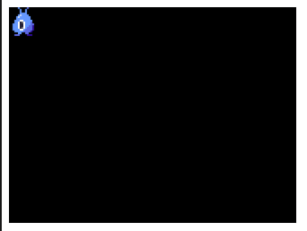

# Javascript シューティングゲーム

## 目次

- [Javascript シューティングゲーム](#javascript-シューティングゲーム)
  - [目次](#目次)
  - [この教材について](#この教材について)
  - [手順](#手順)
    - [Step 00: CodeSandboxアカウントの登録](#step-00-codesandboxアカウントの登録)
    - [Step 01: Java Script と PIXI.jsの始まり](#step-01-java-script-と-pixijsの始まり)
      - [課題 01](#課題-01)
    - [Step 02: キャラクターを表示してみよう](#step-02-キャラクターを表示してみよう)
      - [課題 02](#課題-02)
    - [Step 03: Java Scriptについて](#step-03-java-scriptについて)
      - [課題 03](#課題-03)
    - [Step 04: 自機を表示しよう](#step-04-自機を表示しよう)
    - [Step 05: 矢印キーで自機を移動しよう](#step-05-矢印キーで自機を移動しよう)
    - [Step 06: 自機の移動範囲を制限して画面から出ないようにしよう](#step-06-自機の移動範囲を制限して画面から出ないようにしよう)
    - [Step 07: ミサイルを発射しよう](#step-07-ミサイルを発射しよう)
    - [Step 08: エイリアン（敵）を配置しよう](#step-08-エイリアン敵を配置しよう)
    - [Step 09: エイリアンを規則的に動かそう](#step-09-エイリアンを規則的に動かそう)
    - [Step 10: エイリアンもミサイルを打ってくるようにしよう](#step-10-エイリアンもミサイルを打ってくるようにしよう)
    - [Step 11: エイリアンの種類を増やそう](#step-11-エイリアンの種類を増やそう)
    - [Step 12: ゲームクリア/ゲームオーバー](#step-12-ゲームクリアゲームオーバー)
    - [Step 13: ミサイルを画面内3発まで発射できるようにしよう](#step-13-ミサイルを画面内3発まで発射できるようにしよう)
    - [Step 14: Zキーで3-wayミサイルを発射できるようにしよう](#step-14-zキーで3-wayミサイルを発射できるようにしよう)
    - [Step 15: Xキーでレーザーを発射できるようにしよう](#step-15-xキーでレーザーを発射できるようにしよう)
  - [さらに改良するには？](#さらに改良するには)

## この教材について

- これは「シューティングゲーム」の作り方を通してJava ScriptとPIXI.jsを学ぶための教材です
- この教材では[このCodeSandboxの教材](https://codesandbox.io/s/shooting-game-ijvy1)を使用します

## 手順

### Step 00: CodeSandboxアカウントの登録

- 初回はCodeSandboxにアカウントがないと思いますので、以下の手順でアカウントを作成しましょう
  - <https://codesandbox.io/>から`Sign In`を選択し、`Sign in with Google`を選択
  - 自分のGoogle Account用のパスワードを入力すると、`username`と`display name`を聞かれます
  - この名前は外部から見られますので、本名や本人が特定できる情報は入力しないでください
  - 入力したら、`Finish Sign Up`ボタンを押すと登録完了です
- 次回以降は今回作成したアカウントで`Sign In`（ログイン）できます

### Step 01: Java Script と PIXI.jsの始まり

- まずは[CodeSandboxの教材](https://codesandbox.io/s/shooting-game-ijvy1)を開いてみましょう
- Filesに進むと、以下のようなファイルが用意されています


- `src`フォルダ内にある`index.js`を開いて、内容を全て以下のスクリプトで置き換えてください。同様の内容はCode Sandbox内の`step01.js`にも保存されています。
- Ctrl-Sでセーブすると、初回はForkするか聞かれますので、Yesと答えてください。
- Forkすると、初めに読み込み専用で開いたCode Sandoboxの教材スクリプトを全て自分の環境にコピーし、変更・セーブできるようになります。

```js
import "./styles.css";
import * as PIXI from "pixi.js";

// PIXIの初期設定
let type = "WebGL";
if (!PIXI.utils.isWebGLSupported()) {
  type = "canvas";
}

// PIXIのテスト
PIXI.utils.sayHello(type);

// appの作成
let app = new PIXI.Application({
  width: 320,
  height: 240,
  backgroundColor: 0x000000
});

// appの登録
document.body.appendChild(app.view);
```

- セーブするとブラウザの右側に黒い四角い背景が現れます
- セーブ後ブラウザの右側が再表示されない場合は、右上の再読み込みボタンを押してください
- これがこれから作成するゲーム画面になります
- この段階では、`import`や`let`, `if`, `PIXI.utils...`などは気にしないでください
- 以降のステップで必要な部分は解説します


#### 課題 01

- 背景のサイズは320 x 240になっています。これを400 x 300にするとどうなるか確認してみよう
- 背景の色が0x000000で黒になっています。これはRGBのR(赤）が00, G(緑)が00, B(青)が00、全て0なので黒という意味です。これを赤にするにはどうすればいいでしょう？
  - ヒント:
  - R, G, Bの各要素は00, 01, 02, ... FFとなっていて、16進数で表されています
  - 16進数では, 01, 02, ..., 09の後は0A, 0B, 0C, ..., 0Fと続き、その後に10がきます。
  - 同様に10, 11, ..., 19, 1A, 1B, ..., 1F, 20, 21, ..., 29, 2A, 2B, ...と続きます
  - 16進数では、1バイト（=8ビット)で表すことのできる最大の数字はFF (10進数で255)になります

### Step 02: キャラクターを表示してみよう

- `images/alien1.png1`を表示してみよう
- step01で作成した`index.js`の一番最後に、下のスクリプトを追加しよう
- `//`以降はコメント行で、自由なコメント（自分のメモ）を記述できます
- `loader`はPIXI.jsでスプライト用の画像を読み込むときに使用されます
- `loader.add`で読み込む画像を全て登録後、`loader.load`で読み込んで変数に追加します
- ここではspritesという辞書を用意し、`sprites.alien1`という辞書のアイテムに読み込んだスプライトを設定しています。辞書についてはStep 03で扱います
- 最後に、`app.stage.addChild`にて、作成したスプライトをステージ（画面）に追加します

```js
// 定数
const loader = PIXI.Loader.shared;
const sprites = {};

// spriteの読み込み
loader.add("alien1", "./images/alien1.png", { crossOrigin: "anonymous" });
loader.load((loader, resources) => {
  sprites.alien1 = new PIXI.Sprite(resources.alien1.texture);
  app.stage.addChild(sprites.alien1);
});
```

- うまく行くとalien1が表示されます



#### 課題 02

- Spriteを回転させてみよう
  - ヒント: `sprites.alien1.rotation`
- Spriteの位置を変えてみよう
  - ヒント: `sprites.alien1.position.x`
- 複数のSpriteを表示してみよう
  - ヒント: `sprites.alien1=...`を参考に
- より詳しいPIXI.jsの情報は<https://pixijs.io/guides/basics/getting-started.html>にあります
- 日本語では、<https://github.com/wowowo142/c96>が参考になります

### Step 03: Java Scriptについて

- Step 03では、Step 04以降ゲームを作っていく上で必要なJavascriptの基本について学びます
- `index.js`を全て消去し、以下のように`console.log`を追加して実行してみよう

  ```js
  // Step 03
  console.log("hello");
  ```

- `Console`ウィンドウを開くと`hello`と表示されたのがわかります


- 変数とは
  - 変数`x`の作成と代入
  - `x = 3`の`=`は、右にある数字の3を左にある変数`x`に「代入する（設定する）」という意味です

    ```js
    let x = 3;
    console.log(x);
    ```

  - 作成した変数`x`に1を足す
  - `x = 3`の`=`は、右にある数字の3を左にある変数`x`に「代入する（設定する）」という意味です

    ```js
    x = x + 1;
    console.log(x);
    ```

  - 変数同時は演算することもできます

    ```js
    let a = 10;
    let b = 2;
    let c = a + b;
    console.log(c);
    ```

  - 整数だけでなく、少数や文字列も変数に代入できます

  ```js
  let d = 123.45;
  let s = "hello";
  console.log(d);
  console.log(s);
  ```

  - 文字列と少数又は整数を`+`すると、文字列として連結されます

  ```js
  console.log(d+s);
  ```

- `if`構文とは？

  ```js
  let x1 = 3;
  let x2 = 4;

  /// === では、左辺と右辺が同じならTrueになります
  if (x1 === 3) {
    console.log("x1 is 3");
  } else {
    console.log("x1 is not 3");
  }

  if (x2 === 3) {
    console.log("x2 is 3");
  } else {
    console.log("x2 is not 3");
  }
  ```

- `==`（肩が違っても同じ値ならTrue)と`===`（型も同じでなくてはならない）

  ```js
  let x3 = 3;
  let s3 = "3";
  if (x3 == s3) {
    console.log("==");
  } else {
    console.log("not ==");
  }
  if (x3 === s3) {
    console.log("===");
  } else {
    console.log("not ===");
  }
  ```

- `for`構文とは？
  - `for` 基本型

  ```js
  for (let x4 = 1; x4 <= 3; x4 = x4 + 1) {
    console.log("x4=" + x4);
  }
  ```

  - `++`のようにも書けます

  ```js
  for (let x4 = 1; x4 <= 3; x4++) {
    console.log("x4=" + x4);
  }
  ```

- `array`（配列）とはなんだろう？
  - `array`を使って複数の整数を格納してみよう
  - index（インデックス）を使ってarrayの中身を表示してみよう
  - `for`を使ってarrayの中身を全て表示してみよう
  - index（インデックス）を使ってarrayの中身を変更してみよう

  ```js
  let a1 = [3, 5, 9];
  console.log(a1[0]);
  console.log(a1[1]);
  console.log(a1[2]);

  for (let i = 0; i <= 2; i++) {
    console.log("a1[" + i + "]=" + a1[i]);
  }

  a1[1] = 100;

  for (let i = 0; i <= 2; i++) {
    console.log("a1[" + i + "]=" + a1[i]);
  }
  ```

- `dictionary`（辞書とはなんだろう）？
  - `dictionary`を使って複数の文字列を格納してみよう
  - key（キー）を使ってdictionaryの中身を表示してみよう
  - key（キー）を使ってdictionaryの中身を変更してみよう
  - `for`を使ってdictionaryの中身を全て表示してみよう

  ```js
  let d1 = { apple: 3, orange: 5 };
  console.log(d1);
  console.log(d1["apple"]);
  console.log(d1["orange"]);

  d1["apple"] = 100;
  console.log(d1["apple"]);

  for (let [k, v] of Object.entries(d1)) {
    console.log("k="+k+", v="+v);
  }
  ```

#### 課題 03

- `a1`という変数名のarrayを作って、`for`を使ってそのarrayに1から100までの整数を格納してみよう

  ```js
  a1 = []
  for(let i=0;i<100;i++){
    a1[i] = i;
  }
  ```

- 1から100まで格納した上記`a1`を列挙（巡回）して、全ての数字を表示してみよう
- `dictionary`にいくつかのkey - valueペアを代入しよう
- その`dictionary`を列挙（巡回）して、全てのkey - valueペアを`console.log`してみよう

### Step 04: 自機を表示しよう

- まずは`init(setup, gameloop);`を呼んでゲームを初期化しよう
  - `setup`は最初に1回だけ呼ばれます
  - `gameloop`は1秒間に60回呼ばれます
  - `gameloop`の中でキーボードの状態を取得し、ゲームの進行を行います
- `player.png`を自機として表示してみよう
  - `setup`内で自機を作成してみよう
  - 事前に`sprites.player`, `sprites.alien1`, `sprites.missile`などが用意されています
  - 何が用意されているかは`util.js`の中の`init`関数を見てみよう
  - `util.js`に用意されている`createSprite`関数にsprite.*を渡すと、新しくそのスプライトが作成されます

```js
function setup() {
    // 自機のセットアップ
    player = createSprite(sprites.player);
    player.x = 160;
    player.y = 220;
}
```

- 自機の初期表示位置は(160,20)にしよう

### Step 05: 矢印キーで自機を移動しよう

- キーボード入力は`util.js`内の`keyboard`を使用して取得します
- TBD

### Step 06: 自機の移動範囲を制限して画面から出ないようにしよう

- 自機が画面から出ないように、以下の処理を追加しよう
  - 自機が画面の左端よりも左に来たら、左端に戻す
  - 自機が画面の右端よりも右に来たら、右端に戻す
- 上記を行うには、以下のように書くことができます
  - `Math.max`を使って自機のX座標を現在の値と画面の左端のうち大きい方にする
  - `Math.min`を使って自機のX座標を現在の値と画面の右端のうち小さい方にする

```js
    player.x = Math.max(player.x, player.width / 2);
    player.x = Math.min(player.x, app.view.width - sprites.player.width / 2);
```

### Step 07: ミサイルを発射しよう

- スペースキーでミサイルを1発だけ発射できるようにしよう
- ミサイルが画面にないときはまたミサイルが発射でき、ミサイルが画面内にあるときは発射できないようにしよう
- ミサイルが発射されたら`missile`の位置を自機の位置あたりに設定し、`gameloop`内で位置を更新しよう
- ミサイルは画面の外に出たら消えるようにしよう

### Step 08: エイリアン（敵）を配置しよう

- 配列にエイリアンを格納し、表示しよう
- ミサイルが当たったらエイリアンを消去しよう
- ミサイルにあったかどうかの判定はミサイルとエイリアンのx, y座標の差の絶対値が32以下の場合としよう
- ここまでのステップで少しゲームとして遊べるようになります。

### Step 09: エイリアンを規則的に動かそう

- ここではエイリアンを右に2ドット x 30回、左に2ドット x 30回、また右に2ドット x 30回、...というように周期的に動かしましょう

### Step 10: エイリアンもミサイルを打ってくるようにしよう

- エイリアンもミサイルを打ってくるようにしよう
  - すでに3発のミサイルがエイリアンから画面内に発射されていたらそれ以上は発射しないようにしよう
  - Step09と同様に、`alien_missiles`を巡回中にその要素を削除してはいけないので、`alien_missiles[:]`（コピー）を巡回中に`alien_missiles`の要素を削除しよう

### Step 11: エイリアンの種類を増やそう

- 青いイリアンの下に赤いエイリアンの列、その下に緑のエイリアンの列を作ろう

### Step 12: ゲームクリア/ゲームオーバー

- エイリアンを全て倒したら`Clear`と表示しよう
- エイリアンのミサイルに自機が当たったら`Game Over`と表示しよう
- ゲームクリアもしくはゲームオーバーを3秒表示したら自動的にゲームを再開しよう

### Step 13: ミサイルを画面内3発まで発射できるようにしよう

- 配列を使用してミサイルを画面内3発まで発射できるようにしよう

### Step 14: Zキーで3-wayミサイルを発射できるようにしよう

### Step 15: Xキーでレーザーを発射できるようにしよう

## さらに改良するには？

- 右上にスコアを表示しましょう
- いきなりゲームが始まるのではなく、タイトル画面をつけるにはどうしたら良いでしょう
- どうやったらエイリアンを回転できるか調べてみましょう
- どうやったらエイリアンや自機をアニメーションできるか調べてみましょう
